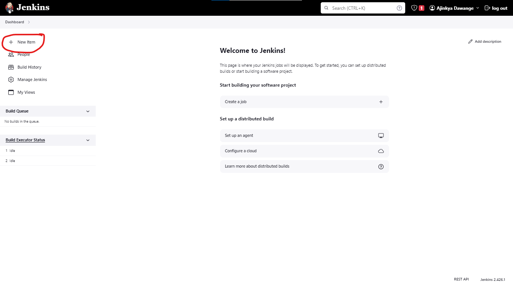
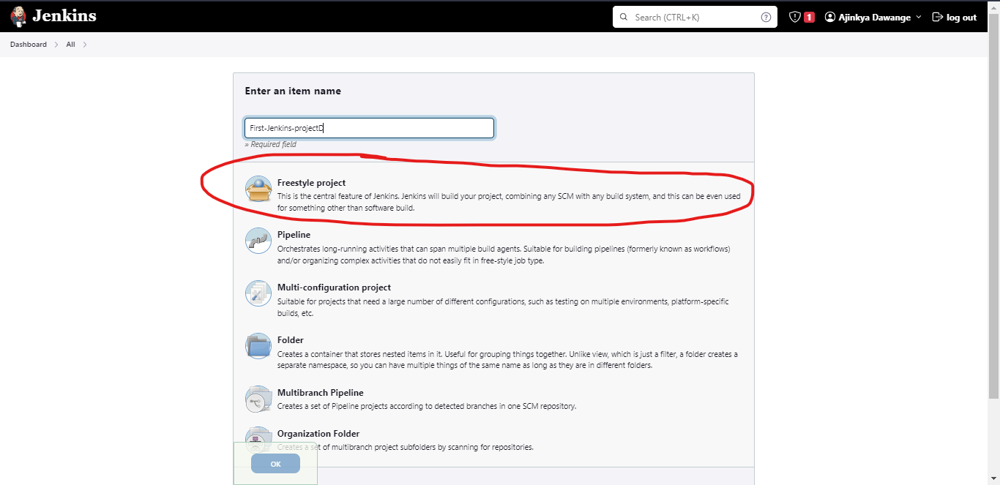
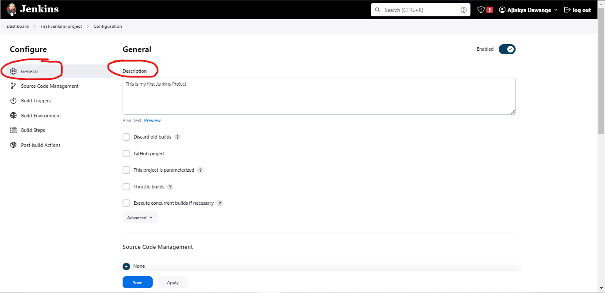
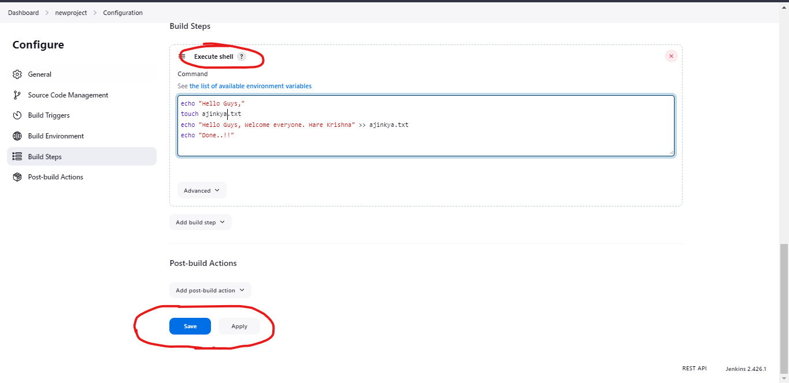
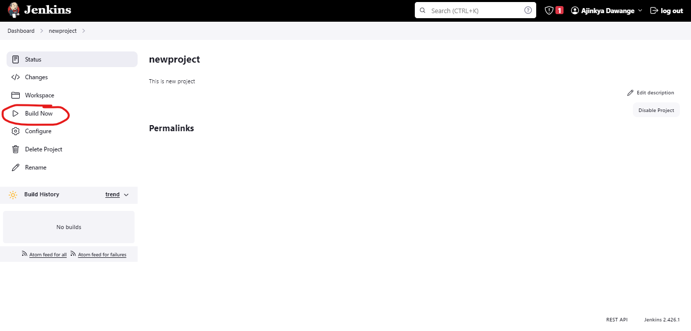
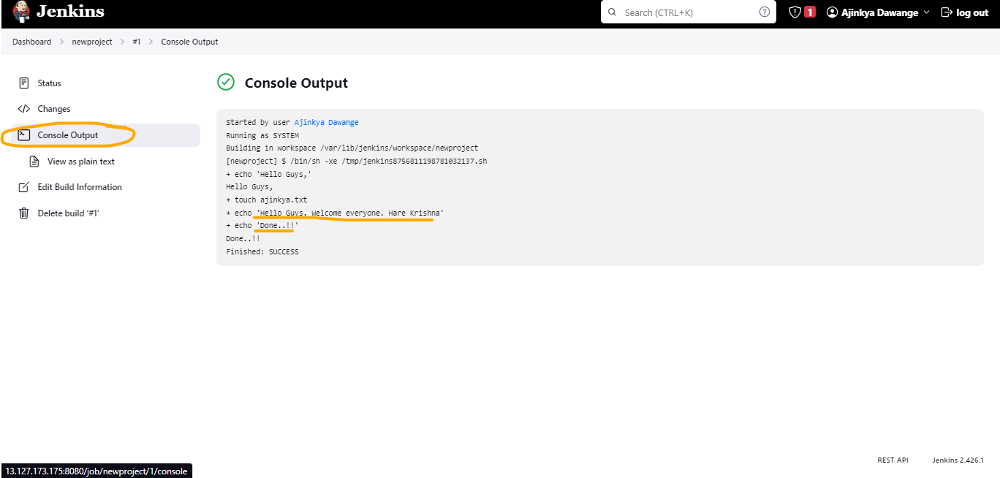

## First Jenkins job

#### If you have not done jenkins set-up, use the following resource and do jenkins setup in 5 minutes.
    For installing in Amazon Linux
    https://github.com/ajinkyadawange31045/Jenkins-Installation-amazon-linux
    
    For installation in Ubuntu OS
    https://github.com/ajinkyadawange31045/Jenkins-Installation-ubuntu

#### Go to dashboard and click on New Item and choose freestyle project




#### Enter some description


#### Go to "Build steps"
#### Click on 'Add Build Step' and select 'Execute Shell'
#### Click on Apply and Save

and enter below text 
```bash
echo "Hello Guys,"
touch ajinkya.txt
echo "Hello Guys, Welcome everyone. Hare Krishna" >> ajinkya.txt
echo "Done..!!"
```


#### Now click on build now -


#### you will see the build starting at the left bottom of the page, start click on that -



