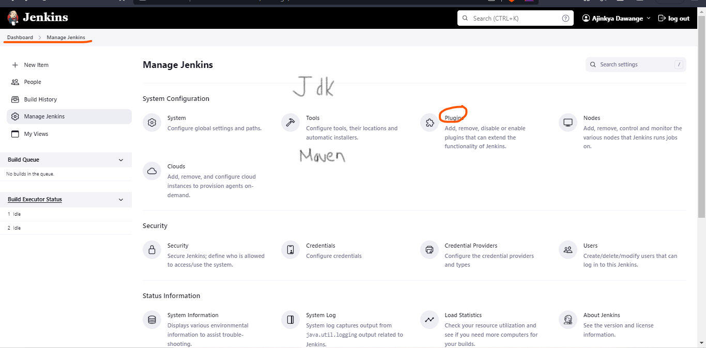

# Jenkins Job with with GIT Hub Repo + Maven - Integeration

## Pre-Requisites : Java, Git & Maven

### Git installation In Ec2:
```bash
sudo yum install git -y
```

### JDK(java development kit) Installation In Jenkins: 
Jenkins Dashboard -> Manage Jenkins -> Tools -> Add JDK -> Choose JDK 8 -> Configure Oracle account crdentials to download JDK.

### Maven Installation In Jenkins: 
Jenkins Dashboard -> Manage Jenkins -->  Tools -> Add maven
For installing maven, oracle account is required, so create it and enter the credentials to coneect with it.

### also install some plugins
Github Integration, Maven Integration, 


## Sample Git Repo URLS For Practise
Git Hub Repo URL-1  : https://github.com/ajinkyadawange31045/maven-project

## Steps To Create Jenkins Job with Git Repo + Maven
### Connect to EC2 instance in which jenkins server got installed
### Start Jenkins Server
### Access Jenkins Server Dashboard and Login with your jenkins credentials
### Create Jenkins Job with Git Hub Repo 
### Refer above folder to get clarity of the below steps.
#### New Item
#### Enter Item Name (Job Name)
#### Select Free Style Project & Click OK
#### Enter some description

### Go to Source Code Management Add Your Github account credentials
-> Enter Project "Git Repo URL"

Add username and password in jenkins credential provider -


### Go to "Build tab"


-> Click on Add Build Step and Select 'Inovke Top Level Maven Targets'


-> Select Maven and enter goals 'clean package'


-> Click on Apply and Save


## Note: With above steps we have created JENKINS Job
### Click on 'Build Now' to start Job execution


### Click on 'Build Number' and then click on 'Console Ouput' to see job execution details.


### Jenkins Home Directory in EC2 : /var/lib/jenkins/workspace/
#### Go to jenkins workspace and then go to job folder then goto target folder then see war file created.

#### Access below URL in browser to stop Jenkins Server
URL : http://EC2-VM-IP:8080/
(Click on Retry using Post button)

